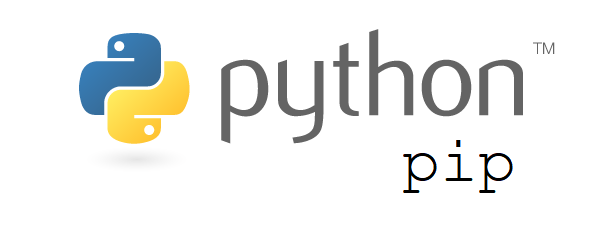

Ansible role: pip3
=========

This role helps you to install pip3 on your linux machine.


|Travis|GitHubActions|Quality|Downloads|Version|
|------|-------------|-------|---------|-------|
|[](https://travis-ci.com/amine7777/ansible-role-pip3)|[](https://github.com/amine7777/ansible-role-pip3/actions)|[](https://galaxy.ansible.com/amine7777/pip3)|[](https://galaxy.ansible.com/amine7777/pip3)|[](https://github.com/amine7777/ansible-role-pip3/releases/)|



Requirements
------------
- Linux machine
- Ansible 2.10

Role Variables
--------------
This role will install python3 and pip3. If you would like to install pip3 packages, all what you have to do is to edit pip3 packages list. The role uses pip module from ansible.

```yaml
pip3_packages:
  - ansible
  - molecule
```

Example Playbook
----------------

```yaml
- hosts: all
  vars:
    pip3_packages:
      - ansible
  roles:
     - amine7777.pip3
```


Author Information
------------------

- [Amine Kahlaoui](https://github.com/amine7777), DevOps engineer.
